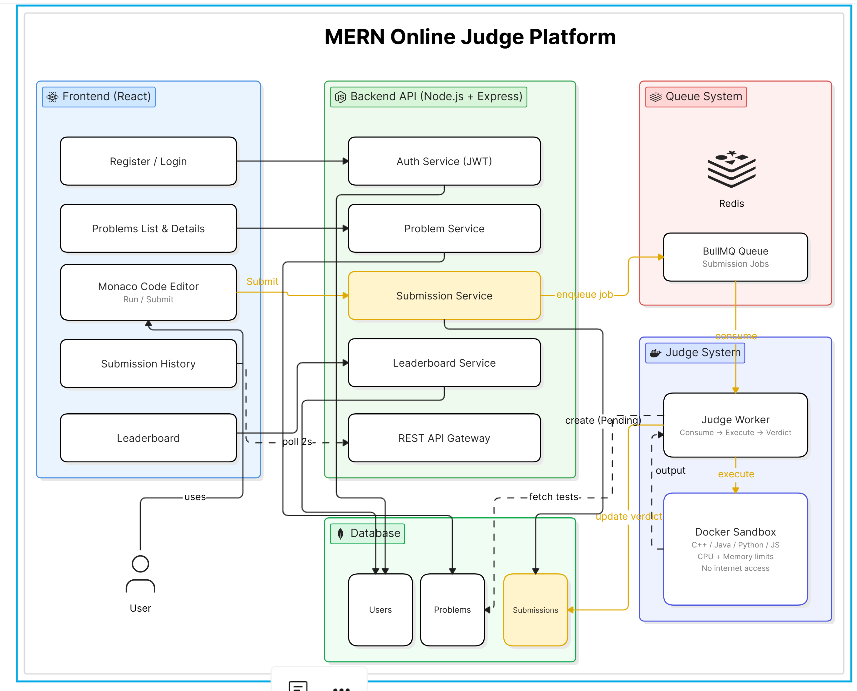

# Algo Online Judge

## Architecture

## System Architecture

The platform follows a modular monolithic architecture with an asynchronous judging pipeline.

### Components

- React Frontend
- Express Backend API
- MongoDB Database
- Redis
- BullMQ Queue
- Judge Worker
- Docker Sandbox

### Submission Flow

1. User submits code
2. Backend creates a pending submission
3. BullMQ enqueues a judging job
4. Judge Worker consumes the job
5. Docker executes the code against hidden test cases
6. Verdict is stored in MongoDB
7. Frontend polls for verdict updates